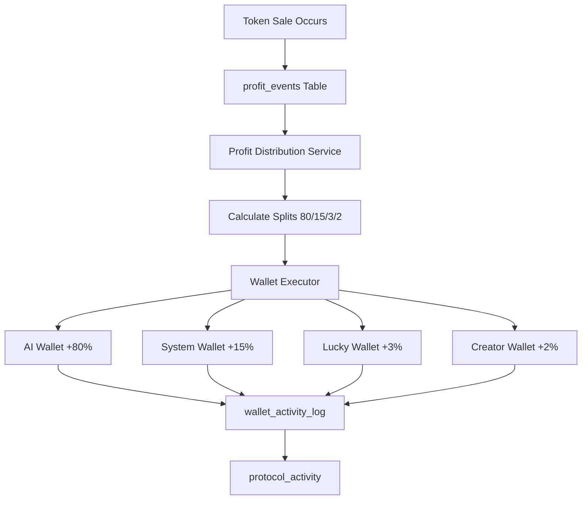

# Profit Distribution System

Automated backend service that distributes token sale profits across the Mind9 4-wallet economy.

## Overview

Every time a token is sold on the platform, the profit is automatically split according to predefined rules and distributed to four distinct wallets that serve different purposes in the ecosystem.

## Distribution Rules

```
Total Sale Profit
       ↓
    Split into:
    ├─ 80% → AI Wallet (reinvestment & autonomous operations)
    ├─ 15% → System/DAO Wallet (treasury & governance)
    ├─ 3% → Lucky Wallet (community rewards)
    └─ 2% → Creator Wallet (original token creator)
```

## System Architecture



## Components

### 1. Profit Distributor Module
**File**: `supabase/functions/_shared/profit-distributor.ts`

Core logic for profit distribution:
- `calculateProfitSplits()` - Computes the 80/15/3/2 split
- `fetchUnprocessedProfitEvents()` - Finds events that need processing
- `distributeProfits()` - Executes the actual transfers
- `logDistribution()` - Records distribution results
- `retryFailedDistributions()` - Handles retry logic

### 2. Distribution Service
**File**: `supabase/functions/distribute-profits/index.ts`

Edge function that orchestrates the distribution process:
- Processes unprocessed profit events
- Manages error handling and retries
- Provides detailed logging
- Returns comprehensive status reports

### 3. Wallet Executor Integration
**File**: `supabase/functions/wallet-executor/index.ts`

Secure transaction signing service that:
- Holds encrypted private keys
- Signs transactions for each wallet
- Submits to Solana RPC
- Returns transaction signatures

## Database Schema

### Input: profit_events
```sql
- id: UUID
- token_id: UUID
- sale_amount: NUMERIC (total profit)
- dao_amount: NUMERIC (15%)
- creator_amount: NUMERIC (2%)
- lucky_amount: NUMERIC (3%)
- reinvestment_amount: NUMERIC (80%)
- timestamp: TIMESTAMPTZ
- transaction_hash: TEXT (unique identifier)
```

### Output: wallet_activity_log
```sql
- id: UUID
- wallet_address: TEXT (wallet identifier)
- token_id: UUID
- activity_type: TEXT ('profit_distribution')
- amount: NUMERIC
- transaction_hash: TEXT (links to profit_event)
- timestamp: TIMESTAMPTZ
```

### Audit: protocol_activity
```sql
- id: UUID
- activity_type: TEXT ('profit_distribution')
- description: TEXT
- metadata: JSONB (splits, transactions, status)
- timestamp: TIMESTAMPTZ
```

## Usage

### Automatic Processing (CRON)

Set up hourly automatic processing:

```sql
SELECT cron.schedule(
  'distribute-profits-hourly',
  '0 * * * *', -- Every hour
  $$
  SELECT net.http_post(
    url := 'https://hrhklzusdctgrwpiacyq.supabase.co/functions/v1/distribute-profits',
    headers := '{"Content-Type": "application/json", "Authorization": "Bearer YOUR_KEY"}'::jsonb,
    body := '{"retry_failed": true, "limit": 100}'::jsonb
  );
  $$
);
```

### Manual Trigger

Process pending distributions:

```bash
curl -X POST https://hrhklzusdctgrwpiacyq.supabase.co/functions/v1/distribute-profits \
  -H "Authorization: Bearer YOUR_ANON_KEY" \
  -H "Content-Type: application/json" \
  -d '{"retry_failed": true, "limit": 50}'
```

### Database Trigger (Real-time)

For instant processing on profit event creation:

```sql
CREATE OR REPLACE FUNCTION trigger_profit_distribution()
RETURNS TRIGGER AS $$
BEGIN
  PERFORM net.http_post(
    url := 'https://your-project.supabase.co/functions/v1/distribute-profits',
    headers := '{"Content-Type": "application/json", "Authorization": "Bearer KEY"}'::jsonb,
    body := '{"limit": 1}'::jsonb
  );
  RETURN NEW;
END;
$$ LANGUAGE plpgsql SECURITY DEFINER;

CREATE TRIGGER on_profit_event_created
  AFTER INSERT ON public.profit_events
  FOR EACH ROW
  EXECUTE FUNCTION trigger_profit_distribution();
```

## Error Handling

### Failure Modes

1. **Single Wallet Transfer Failure**
   - Other wallets continue to receive funds
   - Failed transfer is logged
   - Can be retried independently

2. **Complete Event Failure**
   - Event remains unprocessed
   - Will be picked up in next run
   - Can be manually retried

3. **Network/RPC Issues**
   - Automatic retry with exponential backoff
   - Failures logged for manual review
   - Alert system can be integrated

### Retry Mechanism

Failed distributions are automatically retried when running with `retry_failed: true`:

```typescript
// Retry failed distributions from last 24 hours
{
  "retry_failed": true,
  "limit": 100
}
```

### Idempotency

The system prevents duplicate distributions by:
1. Checking `wallet_activity_log` for existing distribution records
2. Using `transaction_hash` as unique identifier
3. Skipping already-processed events

## Monitoring

### View Distribution Status

```sql
-- Recent distributions
SELECT 
  pa.timestamp,
  pa.description,
  pa.metadata->>'profit_event_id' as event_id,
  pa.metadata->'splits' as splits,
  pa.metadata->>'success' as success
FROM protocol_activity pa
WHERE pa.activity_type = 'profit_distribution'
ORDER BY pa.timestamp DESC
LIMIT 20;
```

### Audit Wallet Balances

```sql
-- Total distributed by wallet
SELECT 
  wallet_address,
  COUNT(*) as distribution_count,
  SUM(amount) as total_received,
  AVG(amount) as avg_distribution,
  MAX(timestamp) as last_distribution
FROM wallet_activity_log
WHERE activity_type = 'profit_distribution'
GROUP BY wallet_address
ORDER BY total_received DESC;
```

### Failed Distributions

```sql
-- Failed distributions requiring attention
SELECT 
  pa.timestamp,
  pa.metadata->>'profit_event_id' as event_id,
  pa.metadata->'failed_count' as failed_transfers,
  pa.metadata->'transactions' as transaction_details
FROM protocol_activity pa
WHERE pa.activity_type = 'profit_distribution'
  AND (pa.metadata->>'success')::boolean = false
  AND pa.timestamp > now() - interval '7 days'
ORDER BY pa.timestamp DESC;
```

### Unprocessed Events

```sql
-- Events waiting to be processed
SELECT 
  pe.id,
  pe.sale_amount,
  pe.timestamp,
  pe.transaction_hash
FROM profit_events pe
WHERE NOT EXISTS (
  SELECT 1 FROM wallet_activity_log wal
  WHERE wal.transaction_hash = pe.transaction_hash
  AND wal.activity_type = 'profit_distribution'
)
ORDER BY pe.timestamp ASC;
```

## Security

✅ **Private Key Management**
- Keys stored as encrypted Supabase secrets
- Never logged or exposed in responses
- Accessed only by secure wallet executor

✅ **Transaction Signing**
- All transactions signed server-side
- No client-side key exposure
- Auditable transaction history

✅ **Access Control**
- Service uses `SUPABASE_SERVICE_ROLE_KEY`
- Edge function can be made public (no auth required) or private
- Rate limiting via Supabase

✅ **Audit Trail**
- All distributions logged to multiple tables
- Transaction hashes provide blockchain verification
- Failed attempts tracked for review

## Performance

- **Throughput**: 50 events/run (configurable)
- **Processing Time**: ~100ms per event
- **Batch Processing**: Sequential with delays to avoid rate limits
- **Scalability**: Can run multiple parallel CRON jobs if needed

## Integration Points

### Existing Systems

1. **profit_events** - Source table for distribution triggers
2. **wallet-executor** - Secure transaction signing
3. **wallet_activity_log** - Activity tracking
4. **protocol_activity** - Transparency logging

### Future Integrations

- Alert system for failures
- Dashboard for monitoring
- Analytics for distribution patterns
- Governance controls for split adjustments

## Troubleshooting

### Issue: No distributions happening

**Diagnosis:**
```sql
-- Check for unprocessed events
SELECT COUNT(*) FROM profit_events pe
WHERE NOT EXISTS (
  SELECT 1 FROM wallet_activity_log wal
  WHERE wal.transaction_hash = pe.transaction_hash
  AND wal.activity_type = 'profit_distribution'
);
```

**Solutions:**
1. Verify CRON job is active
2. Check edge function logs
3. Manually trigger distribution
4. Verify wallet executor is functioning

### Issue: Partial distributions

**Diagnosis:**
```sql
-- Check failed transfers
SELECT * FROM protocol_activity
WHERE activity_type = 'profit_distribution'
AND (metadata->>'success')::boolean = false
ORDER BY timestamp DESC;
```

**Solutions:**
1. Run with `retry_failed: true`
2. Check wallet balances (insufficient funds?)
3. Verify Solana RPC connectivity
4. Review wallet executor logs

### Issue: Duplicate distributions

**Prevention:**
- System uses `transaction_hash` for idempotency
- Check wallet_activity_log before processing

**If it occurs:**
1. Review transaction_hash uniqueness
2. Check for race conditions in CRON timing
3. Verify idempotency logic

## Testing

### Test Distribution

```sql
-- Create test profit event
INSERT INTO profit_events (
  token_id,
  sale_amount,
  dao_amount,
  creator_amount,
  lucky_amount,
  reinvestment_amount,
  transaction_hash
) VALUES (
  (SELECT id FROM tokens LIMIT 1),
  100,  -- 100 SOL total
  15,   -- 15% DAO
  2,    -- 2% Creator
  3,    -- 3% Lucky
  80,   -- 80% AI
  'TEST_' || gen_random_uuid()
);

-- Trigger distribution manually
-- Then check results:
SELECT * FROM wallet_activity_log
WHERE activity_type = 'profit_distribution'
ORDER BY timestamp DESC LIMIT 10;
```

## Maintenance

### Regular Tasks

1. **Weekly**: Review failed distributions
2. **Monthly**: Audit wallet balances vs. expected totals
3. **Quarterly**: Performance optimization review

### Monitoring Metrics

- Distribution success rate
- Average processing time
- Failed transaction rate
- Unprocessed event backlog

## Best Practices

1. ✅ Run with `retry_failed: true` periodically
2. ✅ Monitor unprocessed event count
3. ✅ Set up alerts for consecutive failures
4. ✅ Keep CRON interval appropriate for volume
5. ✅ Review logs regularly for anomalies
6. ✅ Test with small amounts first
7. ✅ Maintain backup of private keys securely

## Conclusion

The profit distribution system provides automated, secure, and transparent handling of token sale profits across the Mind9 economy. It integrates seamlessly with existing wallet infrastructure while maintaining full audit trails and error recovery capabilities.
