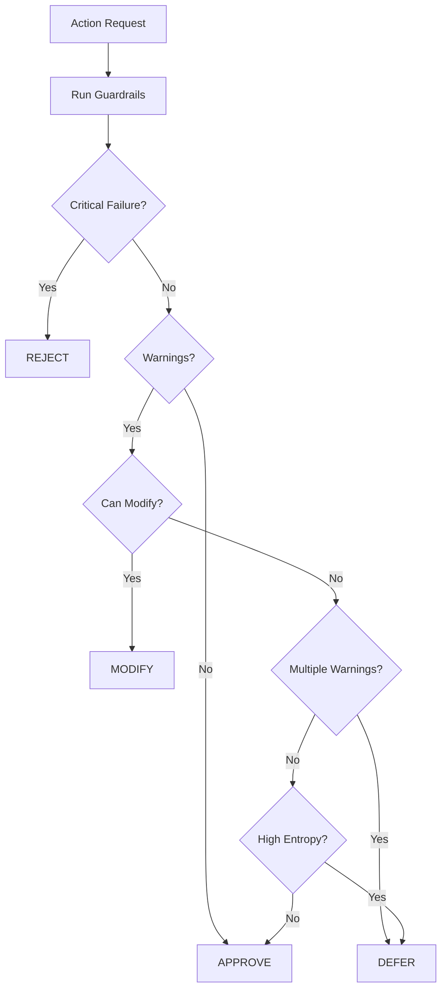

# AI Governor Brain - Economy Oversight System

The Governor Brain acts as the supreme overseer of the entire token economy, reviewing and approving/rejecting actions from other AI systems to maintain system health and security.

## 🎯 Purpose

The Governor Brain provides:
- **Guardrails**: Predefined safety checks to prevent harmful actions
- **Entropy Factor**: Random variability to prevent predictable patterns
- **Market Awareness**: Considers external signals and system metrics
- **Transparency**: Publishes public status updates for user visibility
- **Decision Logging**: Complete audit trail of all decisions

## 🏗️ Architecture

```
┌─────────────────────────────────────────────────────────────┐
│                      Governor Brain                          │
│  (Reviews all major AI decisions before execution)          │
└─────────────────────────────────────────────────────────────┘
                            ▲
                            │
         ┌──────────────────┼──────────────────┐
         │                  │                  │
    ┌────▼────┐      ┌──────▼──────┐   ┌──────▼──────┐
    │   AI    │      │   Profit    │   │   Wallet    │
    │Decision │      │ Rebalancer  │   │  Executor   │
    │ Engine  │      └─────────────┘   └─────────────┘
    └─────────┘
         │
         ▼
   [Execution if approved]
```

## 🛡️ Built-in Guardrails

### Critical Guardrails (Auto-reject on failure)
1. **allocation_total_check**: Ensures profit allocations sum to 100%
2. **rate_limit_check**: Prevents token spam (max 3 per hour)

### Warning Guardrails (Suggest modifications)
1. **minimum_reinvestment**: Ensures at least 40% reinvestment for sustainability
2. **whale_protection**: Blocks transactions exceeding 10% of supply

### Info Guardrails (Advisory)
1. **dao_treasury_cap**: Warns if DAO allocation exceeds 30%

## 📊 Decision Flow



## 🔧 Usage

### From Another Edge Function

```typescript
import { createClient } from "@supabase/supabase-js";

const supabase = createClient(supabaseUrl, supabaseKey);

// Request governor approval
const { data, error } = await supabase.functions.invoke('ai-governor-brain', {
  body: {
    action: 'profit_allocation',
    source: 'profit_rebalancer',
    data: {
      reinvestment_pct: 70,
      dao_pct: 20,
      lucky_pct: 5,
      creator_pct: 5
    }
  }
});

if (data.success && data.decision === 'approved') {
  // Execute the action
  const payload = data.execution_payload;
  // ... proceed with execution
} else {
  console.log('Action rejected:', data.reasoning);
}
```

### Request Format

```typescript
{
  "action": string,        // Action type (e.g., "token_mint", "profit_allocation")
  "source": string,        // Source system (e.g., "ai_decision_engine")
  "data": any             // Action-specific payload
}
```

### Response Format

**Approved/Modified:**
```typescript
{
  "success": true,
  "decision": "approved" | "modified",
  "confidence": 0.0-1.0,
  "reasoning": string,
  "guardrails_triggered": string[],
  "entropy_factor": 0.0-1.0,
  "execution_payload": any,  // Use this for execution
  "log_id": string,
  "public_message"?: string
}
```

**Rejected/Deferred:**
```typescript
{
  "success": false,
  "decision": "rejected" | "deferred",
  "confidence": 0.0-1.0,
  "reasoning": string,
  "guardrails_triggered": string[],
  "entropy_factor": 0.0-1.0,
  "log_id": string,
  "public_message"?: string
}
```

## 📈 Entropy System

The entropy factor adds controlled randomness to prevent predictable behavior:

- **Source Entropy**: Different sources have different base entropy levels
  - `ai_decision_engine`: 0.2
  - `profit_rebalancer`: 0.15
  - `wallet_executor`: 0.1
  - `mind_think`: 0.25

- **Confidence Modifier**: Higher confidence = lower entropy influence
- **Random Component**: Additional 0-0.2 randomness

High entropy (>0.7) may cause deferrals even on otherwise valid actions.

## 🔍 Transparency Features

### Public Status Updates

The Governor publishes user-facing messages for key decisions:

```typescript
// Query public updates
const { data } = await supabase
  .from('governor_status_updates')
  .select('*')
  .order('timestamp', { ascending: false });
```

Example messages:
- ✅ "token mint approved - System checks passed"
- ❌ "profit distribution rejected - Rate limit exceeded"
- ⚙️ "allocation change modified - Increased reinvestment to 40%"
- ⏸️ "token mint deferred - Additional review needed"

### Complete Audit Trail

All decisions are logged to `governor_action_log`:

```sql
SELECT 
  timestamp,
  action_type,
  decision,
  confidence,
  reasoning,
  guardrails_triggered
FROM governor_action_log
ORDER BY timestamp DESC;
```

## 🔐 Security

- Function requires backend authentication (verify_jwt = false for service-to-service)
- All actions are logged with full context
- Critical guardrails cannot be overridden
- Entropy prevents exploitation of predictable patterns

## 🎛️ Customization

### Adding Custom Guardrails

Edit `_shared/governor-brain.ts`:

```typescript
const GUARDRAILS: Guardrail[] = [
  // ... existing guardrails
  {
    name: 'my_custom_check',
    severity: 'warning',
    check: async (payload, context) => {
      if (/* your condition */) {
        return {
          passed: false,
          reason: 'Custom check failed',
          suggestedModification: { /* modifications */ }
        };
      }
      return { passed: true };
    }
  }
];
```

### Adjusting Entropy Levels

Modify `calculateEntropy()` in `_shared/governor-brain.ts`:

```typescript
const sourceEntropy = {
  'my_custom_source': 0.3,
  // ... existing sources
}[decisionSource] || 0.3;
```

## 📊 Monitoring

### Key Metrics to Watch

```sql
-- Rejection rate by source
SELECT 
  decision_source,
  COUNT(*) as total,
  SUM(CASE WHEN decision = 'rejected' THEN 1 ELSE 0 END) as rejected,
  ROUND(100.0 * SUM(CASE WHEN decision = 'rejected' THEN 1 ELSE 0 END) / COUNT(*), 2) as rejection_rate
FROM governor_action_log
GROUP BY decision_source;

-- Most triggered guardrails
SELECT 
  UNNEST(guardrails_triggered) as guardrail,
  COUNT(*) as trigger_count
FROM governor_action_log
WHERE array_length(guardrails_triggered, 1) > 0
GROUP BY guardrail
ORDER BY trigger_count DESC;

-- Average confidence by decision
SELECT 
  decision,
  ROUND(AVG(confidence), 3) as avg_confidence,
  COUNT(*) as count
FROM governor_action_log
GROUP BY decision;
```

## 🚀 Integration Guide

### 1. Update AI Decision Engine

```typescript
// Before executing any action
const governorApproval = await supabase.functions.invoke('ai-governor-brain', {
  body: {
    action: 'create_token',
    source: 'ai_decision_engine',
    data: tokenData
  }
});

if (!governorApproval.data.success) {
  console.log('Governor rejected:', governorApproval.data.reasoning);
  return;
}

// Use approved/modified payload
const finalPayload = governorApproval.data.execution_payload;
```

### 2. Update Profit Rebalancer

Already integrated! The allocation manager now checks with governor before applying changes.

### 3. Update Wallet Executor

Add governor check before executing high-value transactions:

```typescript
if (transactionValue > threshold) {
  const approval = await supabase.functions.invoke('ai-governor-brain', {
    body: {
      action: 'high_value_transfer',
      source: 'wallet_executor',
      data: transferData
    }
  });
  
  if (!approval.data.success) {
    throw new Error('Governor rejected: ' + approval.data.reasoning);
  }
}
```

## 🐛 Troubleshooting

**High rejection rate**:
- Check guardrail logs to identify failing checks
- Consider adjusting thresholds in guardrail definitions
- Review entropy settings if many deferrals

**Entropy causing unpredictable deferrals**:
- Lower base entropy levels in `calculateEntropy()`
- Increase confidence in calling systems
- Review entropy threshold (currently 0.7)

**Slow response times**:
- Optimize guardrail checks (they run sequentially)
- Consider caching system context
- Review database query performance
